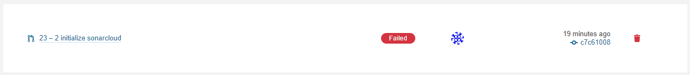
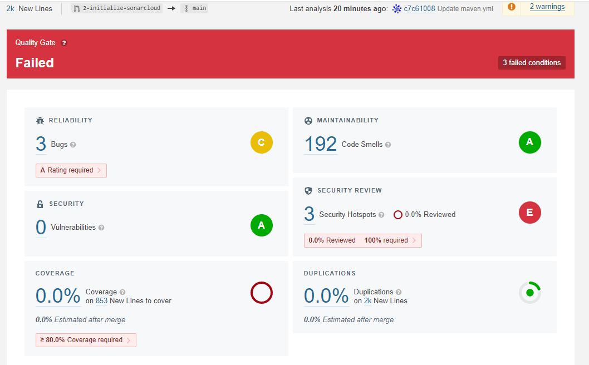

# Manual and Static analysis

## Manuális kód átvizsgálás elvégzése az alkalmazás egy részére

A manuális átvizsgálás során az egy legmegrázóbb felfedett probléma az volt, hogy a java classok nevei nem egyeznek a fájlok neveivel, nem követik a Java-ban használt konvenciókat. Ezeket korrigáltuk. Ugyanitt derült fény arra is, hogy a projekt nem kifejezetten OOP. Az rendezést megvalósító osztályoknak nem volt egy közös ősük, sokszor nem is kompatibilisek egymással. A dokumentáció nem jelezte, hogy ennek van-e bármilyen előre megfontolt alapja, ezért nem refaktoráltuk, de egy issue-t felvettünk ezzel kapcsolatban.

## Statikus analízis eszköz futtatása és a jelzett hibák átnézése

A statikus analízishez eszközének a SonarCloudot választottuk.

A felkonfigurálás utáni első pull request után már le is futott az ellenőrzés. A fenti képen szerint a projekt nem teljesíti a követelményeket.
Ennek részleteit az alábbi képen láthatjuk.

A kód lefedettségével nem foglalkoztunk, hiszen nem írtunk ilyen célból teszteket.

A Security kategóriában 3 problémát jelzett. Ebből kettő a pszeudo random számok generálásával volt kapcsolatos. Mivel mi nem kriptográfiai célokra használjuk az algoritmusokat ennek számunkra nincs jelentősége.
A harmadik hiba alacsony prioritású volt

A megbízhatóság kategóriában 2 bug-ra és 2 code smell-re hívta fel a figyelmünket.
Ezek közül egy castolással kapcsolatos bug-ot javítottunk ki, valamint egy függvényt átalakítottunk lambdává, ezzel eltűntetve egy code smellt.

## Eredmény

A projektünk egy teljesen működő maven projekt lett.

## Tanulság

A github merge-ölési algoritmusa meglepően okos volt, mert különböző ágon változtattuk ugynazazt a fájl-t és semmi hiba nélkül működött a merge mert nem volt ütközés a változtatásokban.